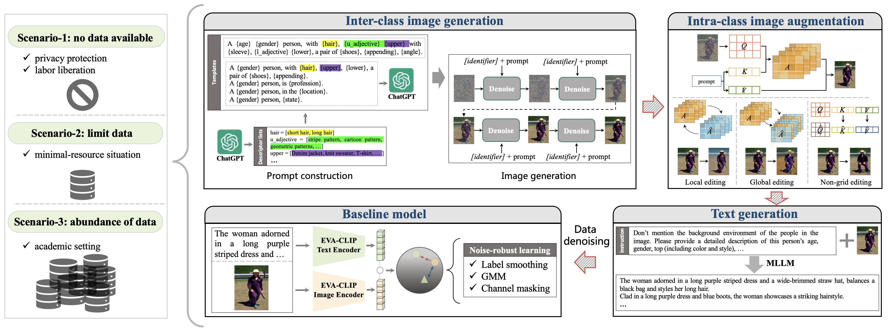

<div>

# An Empirical Study of Validating Synthetic Data for Text-Based Person Retrieval
[](https://arxiv.org/pdf/2503.22171)
</div>

This repository offers the official implementation of [SynTBPR](https://arxiv.org/pdf/2503.22171) in PyTorch.

In the meantime, check out our related papers if you are interested:
+ 【AAAI 2024】 [An Empirical Study of CLIP for Text-based Person Search](https://arxiv.org/abs/2308.10045)
+ 【ACM MM 2023】 [Text-based Person Search without Parallel Image-Text Data](https://arxiv.org/abs/2305.12964)
+ 【IJCAI 2023】 [RaSa: Relation and Sensitivity Aware Representation Learning for Text-based Person Search](https://arxiv.org/abs/2305.13653)
+ 【ICASSP 2022】 [Learning Semantic-Aligned Feature Representation for Text-based Person Search](https://arxiv.org/abs/2112.06714)

## 📖 Abstract

Data plays a pivotal role in Text-Based Person Retrieval (TBPR) research. Mainstream research paradigm necessitates real-world person images with manual textual annotations for training models, posing privacy-sensitive and labor-intensive issues. Several pioneering efforts explore synthetic data for TBPR but still rely on original real data, keeping the aforementioned issues and also resulting in diversity-deficient issue in synthetic datasets, thus impacting TBPR performance. Moreover, these works tend to explore synthetic data for TBPR through limited perspectives, leading to exploration-restricted issue.

In this paper, we conduct an empirical study to explore the potential of synthetic data for TBPR, highlighting three key aspects.

- We propose an inter-class image generation pipeline, in which an automatic prompt construction strategy is introduced to guide generative Artificial Intelligence (AI) models in generating various inter-class images without reliance on original data. 
- We develop an intra-class image augmentation pipeline, in which the generative AI models are applied to further edit the images for obtaining various intra-class images. 
- Building upon the proposed pipelines and an automatic text generation pipeline, we explore the effectiveness of synthetic data in diverse scenarios through extensive experiments. Additionally, we experimentally investigate various noise-robust learning strategies to mitigate the inherent noise in synthetic data.



## 🗓️ TODO

- [x] Release codes
- [x] Release datasets
- [x] Release checkpoints

## 🖨 Dataset

The dataset is released at [Baidu Yun](https://pan.baidu.com/s/1C0EKLobSIB7h7t-OC7wtvg?pwd=4tc4) [4tc4]

## 💾 Checkpoints

The checkpoints is released at [Baidu Yun](https://pan.baidu.com/s/1MFugiq7oGOZTUXBmI5L3PA?pwd=a41g) [a41g]


## Citation
If you find this paper useful, please consider staring 🌟 this repo and citing 📑 our paper:
```
@article{cao2025empirical,
  title={An Empirical Study of Validating Synthetic Data for Text-Based Person Retrieval},
  author={Cao, Min and Zeng, ZiYin and Lu, YuXin and Ye, Mang and Yi, Dong and Wang, Jinqiao},
  journal={arXiv preprint arXiv:2503.22171},
  year={2025}
}
```

## 🙏 Acknowledgements

Since our research was completed with the help of some existing models, we would like to express our sincere gratitude to [TBPS-CLIP](https://github.com/Flame-Chasers/TBPS-CLIP),[EVA-CLIP](https://github.com/baaivision/EVA/tree/master/EVA-CLIP), [stable-diffusion](https://github.com/CompVis/stable-diffusion), [InternVL](https://github.com/OpenGVLab/InternVL), [MiniCPM](https://github.com/OpenBMB/MiniCPM), [Qwen-VL](https://github.com/QwenLM/Qwen-VL), [Qwen2](https://qwenlm.github.io/blog/qwen2/), [NMG](https://github.com/hansam95/NMG), [Instruct-pix2pix](https://github.com/timothybrooks/instruct-pix2pix), [LoRA](https://github.com/microsoft/LoRA), [DreamBooth](https://github.com/google/dreambooth).

## License
This code is distributed under an MIT LICENSE.


## 📧 Contact

If you have any technical comments or questions, please open a new issue or feel free to send email to heath.zeng@outlook.com or mcao@suda.edu.cn.